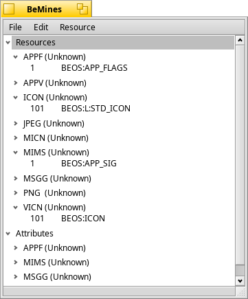

# Resourcer

Resourcer is an open-source resource editor for the BeOS. It contains editors for 32 data types, including windows (for building app interfaces), cursors, images, sounds, movies, icons, and text. It is distributed under the BSD license. You get the source and the latest stable binaries from the downloads page. Please help out if can; Resourcer can not improve without your help.
### News:

Resourcer released under the BSD license.
